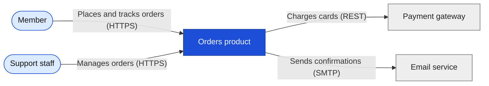
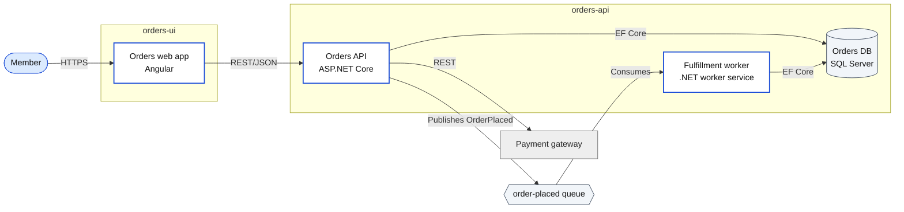
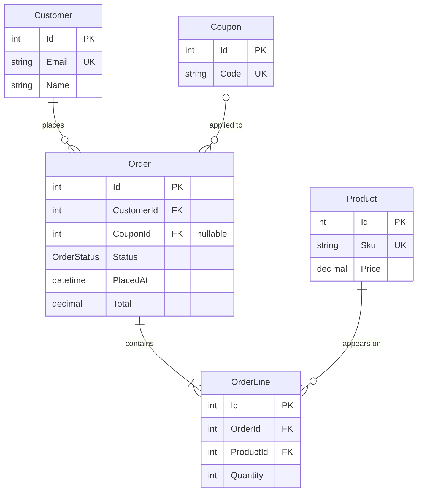
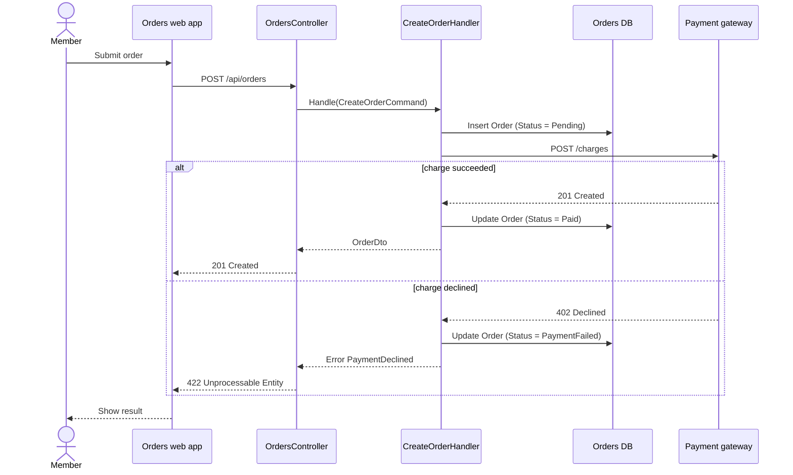
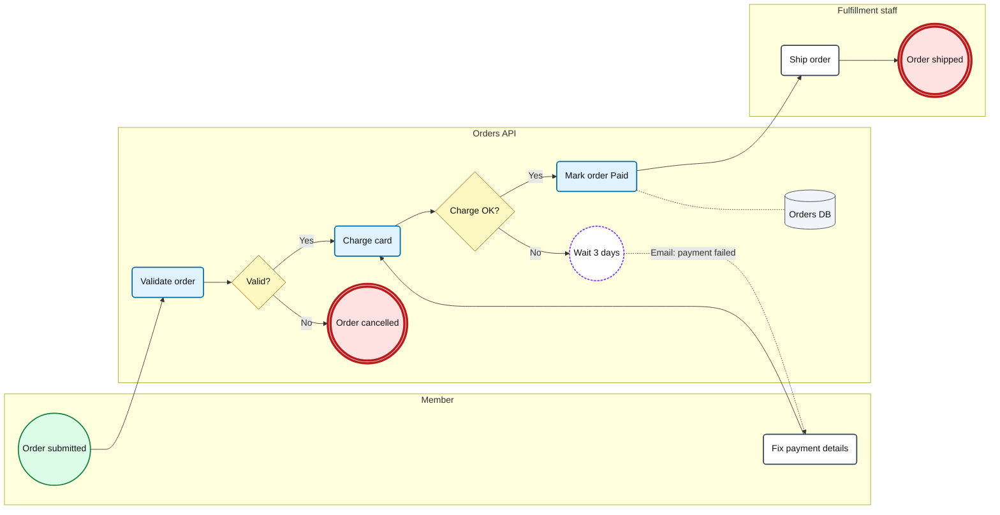
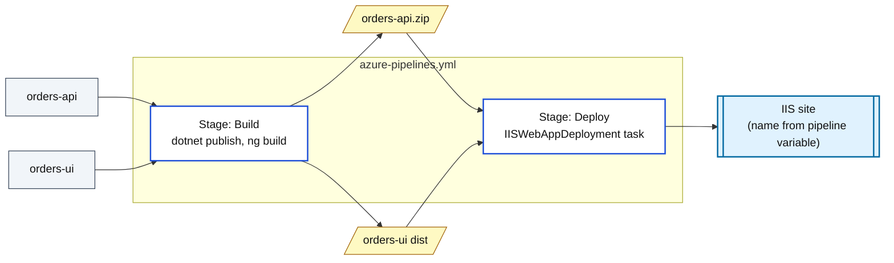

# Diagram cookbook for /tsd

Read this whole file before you draw anything. Copy the example for each diagram and replace the names. Do not invent new shapes, colors, or syntax.

## Rules for every diagram

1. Use a fenced block that starts with ` ```mermaid ` and ends with ` ``` `. One diagram per block.
2. Use only these diagram types: `flowchart`, `sequenceDiagram`, `erDiagram`. Never use `C4Context`, `architecture-beta`, `block-beta`, or the `@{ shape: ... }` syntax. Many doc editors bundle an older Mermaid that cannot draw them.
3. **Node IDs** are short, made of letters, digits, and `_`, and start with a letter: `api`, `ordersDb`, `t1`. Never use these words as an ID: `end`, `graph`, `subgraph`, `style`, `class`, `click`, `default`, `call`.
4. **Labels** always go in double quotes: `api["Orders API"]`. Never put a double quote inside a label. Write a line break as `<br/>`.
5. **Size limits.** Flowcharts: at most 15 nodes. Sequence diagrams: at most 8 participants and 25 messages. ER diagrams: at most 12 entities. If you need more, split into two diagrams and say how they connect.
6. **Only draw what you found.** Every node, arrow, entity, column, and participant must come from `inventory.md`. If you are not sure, leave it out and add it to "Open questions".
7. Comments start with `%%` on their own line.
8. Under every diagram, add the source table from the TSD template.

## 1. System context

The product is one box. Around it: the people who use it and the external systems it talks to. Arrow labels say what flows and how.



## 2. Containers

One box per thing that runs or stores data: web apps, APIs, workers, databases, queues. Group them by repo with `subgraph`. A subgraph ID follows the node ID rules; its label is the repo folder name.

| Thing | Shape |
|---|---|
| App, API, worker | `id["Name<br/>Tech"]:::container` |
| Database | `id[("Name<br/>Engine")]:::store` |
| Queue or topic | `id{{"Name"}}:::store` |
| External system | `id["Name"]:::external` |
| Person | `id(["Name"]):::person` |



## 3. Database schema (ER diagram)

One ER diagram per `DbContext`. Best source: the migrations `*ModelSnapshot.cs` file. Otherwise the `DbSet<>` properties, `IEntityTypeConfiguration<>` classes, and the entity classes.

- **Entity name:** the entity class name. If `ToTable` sets a different table name, put it in the table under the diagram.
- **Columns:** always the primary key and every foreign key. Then at most 6 other columns that help a reader understand the entity. Never invent a column.
- **Column line:** `type name KEY "comment"`. Type is one word: `int`, `long`, `guid`, `string`, `decimal`, `bool`, `datetime`, `date`, or the enum name. KEY is `PK`, `FK`, `UK`, or `PK, FK`. Comment is optional; use `"nullable"` for nullable columns.
- **Relationship line:** `Parent <cardinality> Child : "verb"`. The verb is always quoted.

| In EF Core | Mermaid |
|---|---|
| Required FK, one parent has many children (`HasOne(...).WithMany(...)`, FK not nullable) | `Customer \|\|--o{ Order : "places"` |
| Optional FK (nullable FK property, for example `int?`) | `Coupon \|o--o{ Order : "applied to"` |
| One to one (`HasOne(...).WithOne(...)`) | `Order \|\|--o\| Invoice : "billed by"` |
| Many to many with a join entity | Two one-to-many lines through the join entity |
| Many to many without a join entity (`HasMany(...).WithMany(...)`) | `Order }o--o{ Tag : "tagged with"` |



## 4. Key flows (sequence diagram)

One diagram per flow the engineer picked. Follow the real code path you traced: UI, API controller, handler or service, database or external call.

- Declare every participant first, in order from left to right. `actor` for a person, `participant` for code. The alias text after `as` is **not** quoted.
- Name participants after real classes or systems: `participant OC as OrdersController`.
- Calls use `->>`. Replies use `-->>`. Message text says the method or route: `POST /api/orders`, `CreateOrderHandler.Handle`.
- Never put `;` or `#` in message text.
- Use `alt` / `else` / `end` for branches the code really has. Use `opt` for an optional step. Every `alt`, `opt`, and `loop` needs its own `end`.
- Do not use `activate`, `deactivate`, or `+`/`-` on arrows. They break easily.



## 5. Business process (BPMN-style flowchart)

Mermaid has no BPMN diagram, so draw BPMN shapes in a flowchart. Each lane is a `subgraph` for one role or system. Keep the whole process left to right.

| BPMN element | Shape | Example |
|---|---|---|
| Start event | Circle | `s1(("Start")):::startEvent` |
| End event | Double circle | `e1((("Order closed"))):::endEvent` |
| User task (a person does it) | Rounded box | `t1("Review order"):::userTask` |
| Service task (code does it) | Rounded box, blue | `t2("Charge card"):::serviceTask` |
| Exclusive gateway (decision) | Diamond with a question | `g1{"Approved?"}:::gateway` |
| Wait or timer event | Circle, dashed | `w1(("Wait 3 days")):::waitEvent` |
| Data store | Cylinder | `d1[("Orders DB")]:::dataStore` |

- Sequence flow (the next step): `-->`. Label every arrow that leaves a gateway: `-->|"Yes"|`.
- Message between lanes (email, API call, queue): `-.->|"Email"|`.
- Data read or write: `-.-` with no arrowhead.
- Use the step IDs `s1`, `t1`, `g1`, `w1`, `e1`, numbered in order. Never use the ID `end`.
- Every task must name where it happens in code (in the table under the diagram). A step that only a person does and has no code is allowed; mark it "Manual" in that table.



## 6. Deployment

Draw only what deployment files show: pipeline YAML, `Dockerfile`, `docker-compose*.yml`, `*.bicep`, `*.tf`, Helm charts, and whether a `web.config` exists (IIS hosting). Never guess servers, regions, or environment names. If the files do not show where something runs, stop the diagram at the build artifact and add an open question.

| Thing | Shape |
|---|---|
| Repo | `id["repo-folder"]:::repo` |
| Pipeline stage | `id["Stage: Build"]:::stage` |
| Artifact or image | `id[/"orders-api.zip"/]:::artifact` |
| Runtime host | `id[["IIS site: OrdersApi"]]:::host` |



## Common errors

| Error message or symptom | Cause | Fix |
|---|---|---|
| Flowchart: `Parse error ... got 'end'` | A node ID is `end` | Rename it, for example `e1` |
| Flowchart: `Parse error ... got 'STR'` | A label has a `"` inside it | Quote the whole label once. Remove inner quotes. |
| Flowchart: `Parse error ... got 'PS'` | Parentheses inside an unquoted label | Put the label in double quotes |
| Sequence: `Parse error` on the last line of the block | An `alt`, `opt`, or `loop` has no `end` | Add one `end` for each `alt`, `opt`, and `loop` |
| Sequence: a name shows with quotes around it | The alias after `as` is quoted | Remove the quotes |
| ER: `Expecting 'ATTRIBUTE_WORD' ... got '<'` | A column type has `<...>` or a space, for example `List<int>` | Use a one-word type. Leave collections out; they are relationships. |
| ER: `Expecting 'COLON' ... got 'NEWLINE'` | A relationship has no `: "verb"` | Copy a line from the table in section 3 |
| `Diagram type ... is not allowed` | C4, block, or architecture diagram | Redraw it as a `flowchart` using sections 1 and 2 |
| `The @{ ... } shape syntax needs Mermaid 11.3` | New shape syntax | Use the shapes in the tables above |

## Check before you finish

Do this for every block when the render check was skipped, and any time a block fails:

- [ ] The first line is `flowchart LR`, `flowchart TB`, `sequenceDiagram`, or `erDiagram`.
- [ ] Every node ID is letters, digits, and `_`, and none is a reserved word from rule 3.
- [ ] Every flowchart label is in double quotes, with no `"` inside.
- [ ] Every `subgraph` has a matching `end`. Every `alt`, `opt`, and `loop` has a matching `end`.
- [ ] Every ER column is `type name` with an optional key and an optional quoted comment.
- [ ] Every ER relationship ends with `: "verb"`.
- [ ] Every `classDef` used with `:::` is defined in the same block.
- [ ] The diagram is within the size limits in rule 5.
- [ ] Every element is in `inventory.md`.
