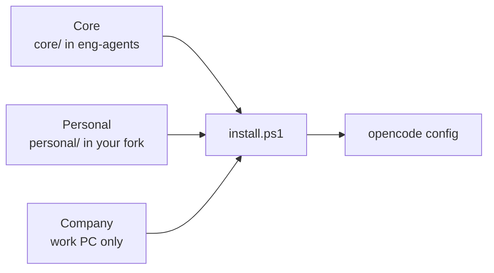

# Field guide

A short overview of how eng-agents works. To set it up, follow the onboarding guides:

- [Personal onboarding](onboarding-personal.md): create your fork and fill in `personal/`
- [Company onboarding](onboarding-company.md): set up your work PC
- [Customization guide](customization.md): what every Personal and Company file is for

You run slash commands, approve specs and plans by editing one line, and always push yourself.

## Layers

| Layer | What | Lives in |
|---|---|---|
| Core | The pipeline: agents, commands, templates, permissions | `core/` in eng-agents |
| Personal | Your preferences: tone, code taste, extra commands | `personal/` in your fork |
| Company | Anything naming your employer: repo map, repo guides, ADO settings | Work PC only |

Higher layers win. eng-agents is the shared base. Each person works from their own fork, which is the base plus their `personal/` folder. The work PC clones that fork.

## A feature at work

| You run | Agent | Your part |
|---|---|---|
| `/start 12345 feature` | planner | Confirm which repos |
| `/spec 12345` | planner | **Gate:** answer questions, approve `spec.md` |
| `/plan 12345` | planner | **Gate:** approve `plan.md` |
| `/tasks 12345` | planner | Skim task sizes |
| `/do-task 12345 1` | implementer | Approve the commit. New session per task. |
| `/review 12345` | reviewer | **Gate:** fix or accept findings |
| `/pr 12345` | writer | Push and open the PR |

Bugs skip spec, plan and tasks (`/bug` instead). `/status` tells you where you left off.

## What lives where

| eng-agents | Your fork | Your work PC |
|---|---|---|
| `core/` | Everything in eng-agents | Company overlay and ADO config |
| `personal/TODO.md`, `company/TODO.md` | `personal/AGENTS.md` | `C:\src\work\AGENTS.md` (repo map) |
| `docs/`, `install.ps1` | `personal/commands/` (optional) | An `AGENTS.md` in each repo |

## Getting set up

| | Step | Guide |
|---|---|---|
| 1 | Fork eng-agents and fill in `personal/` | [Personal onboarding](onboarding-personal.md) |
| 2 | Set up the work PC: ADO, overlay, repo map, repo guides | [Company onboarding](onboarding-company.md) |
| 3 | Smoke test: take one small bug through the bug lane | [Company onboarding](onboarding-company.md#6-verify-and-smoke-test) |
| 4 | Use it on real work, every lane at least once | |

## Where does a fix go?

| If it... | Put it in |
|---|---|
| Names something at your company | Work PC (overlay or repo guide) |
| Is just your preference | `personal/` in your fork |
| Would help anyone | `core/` in eng-agents (pull request), then merge into your fork |
