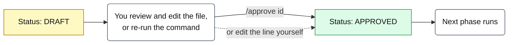
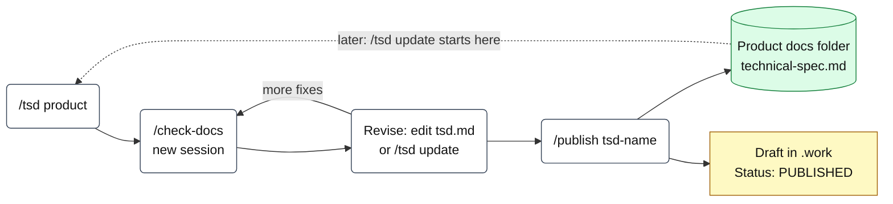

# Pipeline

How each phase works, why it is shaped this way, and what to do when it goes wrong. Daily commands are in the [README](../README.md). Which agent runs each command, and what it may do, is in [Customization](customization.md#agents).

```
/start <id> feature    fetch work item, create .work/<id>-<name>/, confirm repos, create branches
                       (add a repo folder or ADO connection as a 3rd argument for another collection)
/spec <id>             questions one at a time, then spec.md        GATE: /approve <id>
/plan <id>             files per repo, pattern to follow, test plan GATE: /approve <id>
/tasks <id>            small tasks, each with a verify command      skim task sizes
/do-task <id> <n>      one task per fresh session, TDD, commit      repeat
/review <id>           pass 1 spec, pass 2 quality                  accept findings as tasks
/pr <id>               short title and description per repo
You push and open the PR. Your normal review and CI/CD take it to production.
```

## Design choices

Built for a slower model that needs explicit procedures.

| Choice | Why |
|---|---|
| Every command is a numbered list of steps | Weaker models follow procedures far better than goals. |
| Every command re-reads files from disk | Nothing has to be remembered across sessions. |
| Gates are a `Status:` line, set by `/approve` or by you | Approval is a fact on disk, not a judgment the model makes. |
| One task per fresh session | Context stays small. Long sessions are where weaker models drift. |
| Agents have narrow permissions | A planner that cannot edit code cannot start coding. |
| Stop after 3 failures | Prevents long loops that make things worse. |
| Verify output is pasted into `progress.md` | No "it should work now" without proof. |
| A template for every file | Filling blanks is more reliable than free-form writing. |

## Gates

A gate is the `Status:` line at the top of a file. Nothing moves past a gate until you approve it. Approve with a command, so you never have to edit the line by hand:

| File | Created by | Approve with | Checked by |
|---|---|---|---|
| `spec.md` | `/spec` | `/approve <id>` | `/plan` |
| `plan.md` | `/plan` | `/approve <id>` | `/tasks`, `/do-task` (feature lane) |
| `bug.md` | `/bug` | `/approve <id>` | `/do-task` (bug lane) |
| `tsd.md` | `/tsd` | `/publish tsd-<name>` (approves and moves it) | `/tsd` (refuses to overwrite an approved TSD) |



**`/approve <id> [spec|plan|bug]`** (planner)

- With no file named, it approves the first DRAFT in this order: `spec.md`, `plan.md`, `bug.md`. Name one to be explicit: `/approve 12345 plan`.
- It refuses a plan while the spec is still DRAFT, and refuses anything on a paused item.
- If "Open questions" still has items, it shows them and asks. Yes marks each one `(accepted risk)`; no stops so you can answer them first.
- It changes only the `Status:` line, logs to `progress.md`, and gives the next command (`/plan`, `/tasks`, or `/do-task <id> 1` in a new session).

Editing the line yourself still works; the next command reads whatever is on disk. Agents never set `APPROVED` in any other command. To send a draft back, leave it as DRAFT, add notes under "Open questions", and re-run the same command. It refines the draft instead of starting over.

## Lanes

| Lane | Use when | Flow |
|---|---|---|
| Feature | New behavior, or more than 3 files of change | Full pipeline |
| Bug | A defect with a reproducible symptom | `/start` → `/bug` → `/approve` → `/do-task` (repeat) → `/review` → `/pr` |
| Spike | You do not know enough to write a spec | `/spike` writes `findings.md`. No code changes. Good input to a later `/spec`. |
| Docs | Writing or updating documentation | `/docs` (writer) → new session → `/check-docs` (reviewer fact-checks every claim) |
| TSD | A technical spec of a product or repos, told through diagrams | `/tsd` (writer) → new session → `/check-docs` (reviewer checks every box and arrow) → revise → `/publish tsd-<name>` (approves it and moves it to the product docs folder) |

Bug lane rules:

- `/bug` writes `bug.md` (symptom, code path, root cause with confidence) and a `tasks.md` with **at most 3 tasks**.
- Task 1 is always a test that fails because of the bug.
- If root-cause confidence is Low, `/bug` stops and points you to `/spike`.
- If the fix needs more than 3 tasks, it moves to the feature lane (`/spec`).

## Technical specs (/tsd)

`/tsd <product>` documents a whole product from the repo map's Products block. `/tsd <repo> [repo ...]` documents named repos and offers to add the other repos in the same product.

| Step | What happens |
|---|---|
| Scope | Repos from the product block. You confirm the list. |
| Inventory | `inventory.md`: deployables, DbContexts and entities, external systems, entry points, background jobs, auth, status fields, deployment files. Every row cites a file. Config files are never opened; key names come from code. |
| Picks | It proposes flows and business processes. You pick 3 to 5 flows and 1 to 3 processes. It traces each through the code. |
| Write | `tsd.md` from the template. Each diagram copies a pattern from `templates/tsd-diagrams.md`. |
| Check | `Test-Mermaid.ps1` renders every block with mermaid-cli and reports the failing ones with the file line. Without mermaid-cli it runs static checks and the agent works through a checklist. |
| Fact-check | New session, `/check-docs .work/tsd-<name>/tsd.md`. Every box, arrow, entity, and column is checked against the code. |
| Revise | Edit `tsd.md` yourself or re-run `/tsd` (update). |
| Publish | `/publish tsd-<name>` is your approval. It warns if there is no fact-check or the check found errors, copies the TSD to the product's "Product docs" folder from the repo map (or a folder you name) as `technical-spec.md`, drops the agent comments, stamps `Approved: <date>`, and marks the `.work` copy `PUBLISHED`. You commit it. |



The `.work` copy is the draft; the published copy is the live one. A later `/tsd` update starts from the published copy, so edits you make there are kept.

**`/publish <folder>`** (writer) is generic: it handles any `.work` folder that holds a publishable document. Today that is `tsd.md`. To add another kind (for example spike findings), add a row to the table in `core/commands/publish.md` with its default destination and file name.

| Diagram | Mermaid type | Drawn from |
|---|---|---|
| System context | `flowchart` | Product block, external calls in code |
| Containers | `flowchart` with a subgraph per repo | Deployable projects, DbContexts, queues, HTTP clients |
| Database schema | `erDiagram`, one per DbContext | Migrations `*ModelSnapshot.cs`, else entity configs |
| Key flows | `sequenceDiagram` | Code path traced from the entry point |
| Business processes | BPMN-style `flowchart` (lanes, events, gateways) | Status fields, handlers, product block, product docs |
| Deployment | `flowchart` | Pipeline YAML, Dockerfile, IaC files |

Only `flowchart`, `sequenceDiagram`, and `erDiagram` are used, because doc editors often bundle an older Mermaid. Mermaid has no BPMN diagram, so processes use BPMN shapes and colors in a flowchart; the legend is in the TSD.

Better input gives better diagrams: fill in "External systems" and "Business processes" in each product block of the repo map, and link the product docs.

## Phase notes

**/start**
- A script creates the folder name and slug, so branch names are consistent: `dev/<lane>/<id>-<short-name>`.
- With several ADO collections, the script picks the connection from the optional third argument (a connection name or a repo folder), a `paths` mapping, the repo's `origin` URL, or `default`. If it cannot tell, the planner asks you. `workitem.md` records which connection it came from. Setup: [Connect to ADO](onboarding-company.md#3-connect-to-ado).
- If ADO is unreachable, offline mode creates the folder from a title you paste; then you paste the details into `workitem.md`.
- Proposes repos from the repo map and asks you to confirm.
- Never switches a repo with uncommitted changes (skips it). Asks before switching a repo that is on another item's `dev/` branch.

**/spec**
- Questions come one at a time with options and a recommendation, so you can reply "A" or "yes".
- At most 6 questions. If the item needs more, consider splitting it in ADO.

**/plan**
- Each repo section names a "pattern to follow": a real file that does something similar. This is the most effective way to get consistent code from a weaker model.
- The test plan maps every acceptance criterion to a test before any code exists.

**/tasks**
- Each task touches one repo and at most 3 files (or your configured cap). Split big-looking tasks by hand before starting.
- A coverage table proves every acceptance criterion has a task.

**/do-task**
- Always in a new session. Checks the gate, the branch, and that the repo has no unrelated changes.
- .NET is strict TDD: both the failing and the passing run go in `progress.md`. If the "failing" run passed, the test does not test the change.
- Stages only the task's files and commits with a short summary. You approve the commit.

**/review**
- Runs every repo's unit tests, then reads the diff against `origin/main`.
- Pass 1 (spec) and pass 2 (quality) are separate, so spec checks are not skipped in favor of style comments.
- Verdict is `READY` only if tests pass, every criterion is `Met`, and there are no Blockers. Findings you accept are appended to `tasks.md`.

**/pr**
- Title under 70 characters, one or two sentences, up to 4 bullets, a testing line, the work item link.
- Never pushes. You push each branch and open the PR.

## Work files

All state lives in the workspace, outside every git repo, and never leaves the work PC.

```
.work/<id>-<short-name>/
  workitem.md   repos.md   spec.md   plan.md   tasks.md
  progress.md   review.md  pr.md     bug.md    findings.md   paused.md

.work/spike-<short-name>/findings.md     spike without a work item
.work/docs-<short-name>/sources.md       docs lane: claims and their source files
.work/docs-<short-name>/check.md         docs lane: fact-check results
.work/tsd-<short-name>/                  TSD draft: inventory.md (facts), tsd.md, sources.md, check.md,
                                         render/ (one SVG per diagram). /publish copies tsd.md out.
.work/_onboard/<repo>-AGENTS.md          onboard draft when the repo already has a repo guide
                                         (<repo>-AGENTS.local.md when the team committed its own AGENTS.md)
```

`<short-name>` is the first 5 words of the work item title, lowercase, filler words dropped, at most 40 characters.

## Shared repos

- Consumers reference shared code by relative path, so one flat clone in the workspace satisfies all of them. Duplicate clones drift apart.
- The repo map records which repos depend on each shared repo. `repos.md`, the plan, and tasks put shared repos first.
- `/review` runs tests in every repo in `repos.md`. Add any other consumer that could break so its tests run too.
- If a shared repo is consumed as a published package instead, the plan needs a version bump task. Note that in the repo map.
- Need a shared repo on two branches at once? Add a worktree instead of a second clone, and remove it after the PR merges. Relative-path consumers still point at the main clone.

  ```powershell
  git -C C:\src\work\<shared-repo> worktree add ..\<shared-repo>-12345 dev/feature/12345-short-name
  git -C C:\src\work\<shared-repo> worktree remove ..\<shared-repo>-12345
  ```

## Pausing and resuming

`/pause <id> [reason]` when you drop an item for a while.

- Writes `paused.md`: phase, tasks done, the task in progress and what is left of it, what it is waiting on, and the next command.
- For uncommitted changes it asks one question: commit as `WIP <id>: ...` (frees the repo) or leave them. Nothing is stashed or discarded.
- While paused, agents refuse other pipeline commands on the item except `/status` and `/resume`.

`/resume <id>` switches each repo back to the item's branch (asking first if a repo is on another item's branch), warns if `main` has moved, marks `paused.md` as `RESUMED`, and gives the next command. A half-done task continues from the "Work in progress" notes. Squash WIP commits when merging if your team prefers clean history.

## Repo guides, team guides, and memory

Agents learn a repo from three places, read in this order:

| Source | Where | Written by |
|---|---|---|
| Repo guide | `<repo>\AGENTS.local.md` if it exists, otherwise `<repo>\AGENTS.md`. Never committed. | `/onboard-repo`, then you |
| Team guides | Committed `CLAUDE.md` and similar files listed in the repo guide's "Team guides" table | Your team |
| Repo memory | The repo guide's `## Remembered` section | `/memory <rule>` |

Plus **global memory** in `%USERPROFILE%\.config\eng-agents\memory.md` (`/memory -global <rule>`), loaded in every session. The repo guide wins over a team guide, and repo memory wins over global memory.

- `/memory <rule>` uses the repo you are working in, or asks. `/memory <repo> <rule>` names it. `/memory -list` shows everything saved.
- It checks for a duplicate or contradicting line first, and offers to fix a wrong command or path in the repo guide instead of adding a memory line.
- Run it in the session where the rule came up, so "remember that" can be resolved to the real thing.
- Edit or delete memory lines by hand any time. Re-running `/onboard-repo` keeps the `## Remembered` section.

## Recovering from problems

| Situation | What to do |
|---|---|
| A session went off the rails | Close it, start a new one, run `/status <id>`. State is on disk. |
| A task is marked done but is wrong | Uncheck it in `tasks.md`, revert the commit yourself if needed (`git -C <repo> revert <sha>`), re-run `/do-task`. |
| A task keeps failing | Read the blocked entry in `progress.md`. Usually the task is too big or the pattern file is wrong. Split the task or fix the plan. |
| The plan was wrong after tasks started | Edit `plan.md` and `tasks.md` by hand. Add new tasks at the end; do not renumber finished ones. |
| Work item scope changed | Update `workitem.md`, set `spec.md` back to DRAFT, re-run `/spec`, then re-plan. |
| Abandon an item | Delete its `.work` folder and its branches yourself. |

## Tuning when the model struggles

| Symptom | Fix |
|---|---|
| Task fails or wanders | Split it into smaller tasks. |
| Ignores a convention | `/memory <rule>` saves it to that repo's guide; `/memory -global <rule>` saves it for every repo. Rules said in chat do not carry over. |
| Claims done without proof | Verify output must be in `progress.md`. Re-run `/do-task` and point at the missing evidence. |
| Asks too many questions | Answer them in `spec.md` directly, then re-run the next command. |
| Plans touch the wrong repo or order | Fix the repo map. |
| A TSD diagram keeps failing to render | Fix the block by hand using "Common errors" in `templates/tsd-diagrams.md`, then run `Test-Mermaid.ps1` yourself. |
| A TSD draws things that do not exist | Check `inventory.md` for the bad row and its source. Fix or delete it, then re-run `/tsd` and choose update. |

## Scripting with `opencode run`

Use the interactive window for real work. In testing, `opencode run "/spec 12345"` did not always expand the slash command (the model had to find the command file itself), and the question tool was unavailable, so questions came back as plain text.
